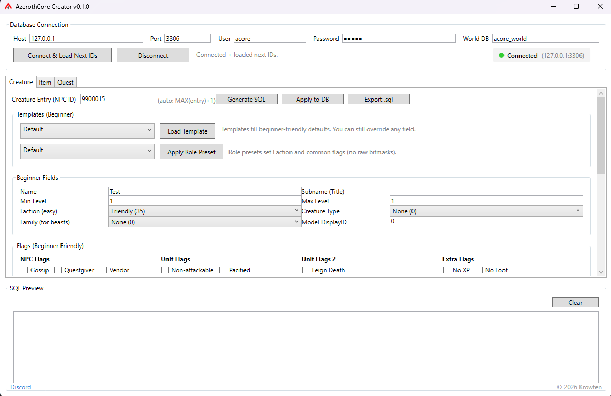
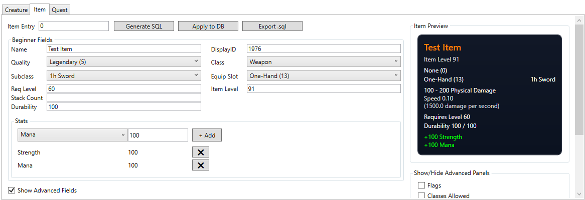
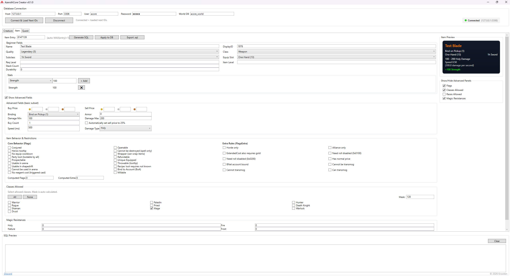

<h1 align="left">
  
  AzerothCore Creator
</h1>

A modern desktop toolkit for building and managing AzerothCore content — without wrestling raw SQL.

---

## 🚧 Currently in Beta

> ⚠️ **Run Setup.exe to recieve automatic updates**

---

## 🖼 Interface Preview

---

### 🧟 Creature Editor

  

Build creatures the sane way.

The Creature Editor provides structured support for AzerothCore’s `creature_template` table with beginner-friendly field grouping, role presets, faction handling, and clear flag toggles.

The layout mirrors classic Trinity-style tools — but maps cleanly and directly to AzerothCore’s schema.

No guesswork. No mystery flags. No raw table hunting.

---

### 🧾 SQL Preview Generation

  

Every change generates clean, readable SQL with transactional safety.

Preview it. Export it. Or push it straight to your database.

Because your tools should work with you — not against you.

---

### 🎒 Item Editor (Trinity-Style Layout)

  

  

The Item Editor follows a familiar Trinity-style layout with full AzerothCore alignment.

Toggle-based flags, class restrictions, race restrictions, and magic resistances make configuration intuitive — no bitmask math required.

Live tooltip preview ensures your item looks correct before it ever hits the database.

Design it. See it. Ship it.

---

### 🔎 Integrated Item Search

  

Quick lookup by name or ID keeps your workflow moving.

Cross-reference rewards, requirements, and dependencies without jumping between tools.

Less alt-tabbing. More building.

---

### 📜 Quest Editor with Live Preview

  

Structured support for `quest_template` with organized reward handling, requirement configuration, and a live quest preview panel.

Build complex quest chains without losing track of what connects to what.

---

## 🎯 Built Specifically for AzerothCore

- ✔ Hardcoded for AzerothCore (not generic Trinity tooling)
- ✔ Designed for WotLK (3.3.5a)
- ✔ Modern UI over legacy workflows
- ✔ Built with long-term expansion in mind

---

## 💬 Community & Feedback

Have an idea? Found a bug? Want a feature?

Join the Discord and help shape the roadmap:

👉 https://discord.gg/nVFp9ec
